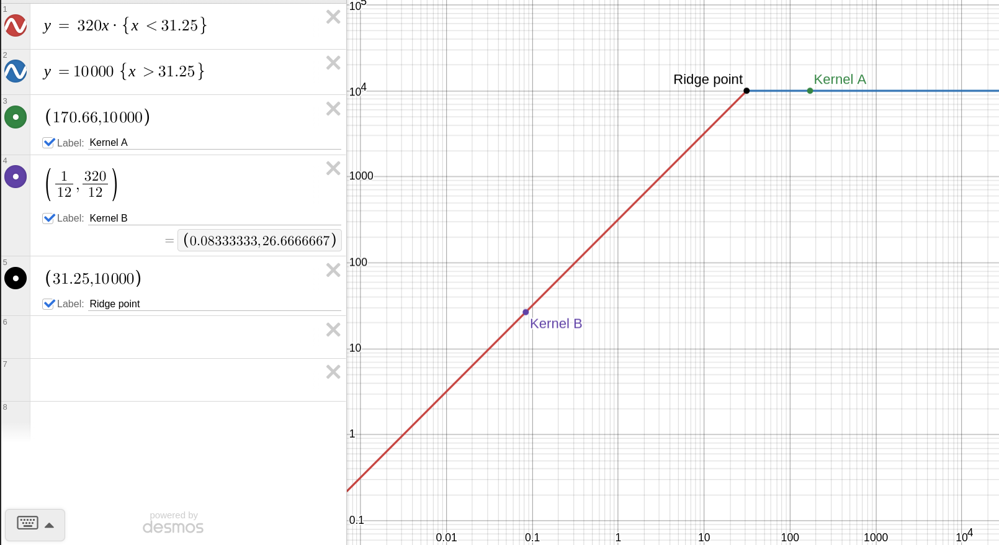

### Specifications 
|parameter| value|
|:-----|:-----:|
| peak compute | 10 TFLOPS (FP32)|
|peak DRAM bandwidth | 320 GB/s | 
|ridge point | 10,000/320 ≈ 31.25 FLOP/byte|

### 2. Kernel A:  
>**Arithmatic intensity**:  
 I = N /6  
 N = 1024  
 I = 1024/6  
 I = 170.66
 **performance ceil(Pceil)**:  
(I > ridge_point)? Ppeak : Bpeak* Arithmatic_intensity  
Pceil_A = Ppeak = 10 TFLOPS/s

### 3. Kernel B: 
>N = 4,194,304  
**FLOPS**:  
4,194,304 fp32 add operations  
**Bytes transfered**:  
4,194,304 * 3 * 4 = 33553332  
33,553,332 bytes transfered  
**Arithmatic intensity**:  
I = N/ (N *3*4) 
I = 1/12 
**performance ceil(Pceil)**:
Bpeak * I
320 GB/s * 1/12 flops/B
Pceil = 320/12 = 26.67 GFLOPs/s

### Roofline plot (Desmos) 

>note: Axis y is Performance in (Gflops/s), Axis x is Arithmatic intensity (FLOP/B)
### 4. Comparison
| Kernel | A | B | 
|:---|:---:|:---:
|state| compute-bound | memory-bound|
|performance ceiling| 10 TFLOPS/s | 26.67 GFLOPs/s | 
|architectural change| improve data path | improve functional unit| 
**Recomendation**:
+ For Kenel A, it is best to optimize performance by implementing New hardware that performs better computation
+ For Kernel B, it is best to optimize the data path, since 
kernel b is memory bound.