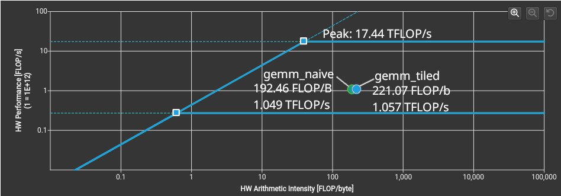

# gemm_analysis

## 1 & 2. Hardware  and program overview
+ Naive and titled GEMM was created in cuda
+ both files included a cuda startup time, a warmup run, 100 runs, and the average of the 100 runs
+ per run time is set to include 3 cudaMemcpy (one for each matrix) and the multiplication function
+ matrix is randomized and pushed every iteration
+ float is matrix is created, float is 32 bits while double is 64 bits.
+ N is 1024, square matrix
+ FLOPs = 2*N^3 = 2 x (2^10)^3 = 2^31 = 2 GFLOPs
+ Performance = 2 GFLOPs / average time = GFLOPS

|Parameter| Hardware| PEAK |
|:---|---|---|
|CPU| i7-7700K| Not releveant| 
|GPU | NVIDIA RTX 5060| ~19 TFLOPS| 
|Memory| dual channel DDR4 3000 (PC4 24000)| 24GB/s|
|Motherboard bus| PCIe 3 (x8)| 8 GB/s | 
*RTX 5060 support 8 lanes not 16 lanes PCIe

## 3. Measured execution time 
|parameter|gemm_naive|gemm_tiled|
|:---|---|---|
|warmup (1st run) [ms]|9.701984 | 7.382944 |
|average of 100 runs (total)[ms]| 3.657006 | 3.657310 |
|average of 100 runs (kernel only) [ms]| 1.694092 | 1.646113 |
|Performance Total [TFLOP/s] | 0.547  | 0.547 |
|Performance Kernel [TFLOP/s] | 1.208  | 1.215 |

## 4. Nsight Compute profile
|Nsight Compute results (1st run after warmup) |gemm_naive|gemm_tiled|
|:---|---|---|
|SM Frequency [GHz] | 2.27  | 2.27  |
|Memory Throughput [Gbyte/s]|	5.45| 	4.78|
|HW Arithmetic Intensity [FLOP/byte]| 192.46| 221.07|
|HW Performance [TFLOP/s]| 1.049 | 1.057 |
|Bound |Compute bound|Compute bound|
Nsight peak throughput: 17.44 TFLOP/s  
Nsight peak bandwidth: 441.2 GB/s  
Nsight ridgepoint: 39.52 FLOP/B  

## 5. Roofline chart


## 6. Analysis 
+ (a) the naive kernel is not memory bound. The matrix is small so everything gets loaded into the GPU's L1 cache, where the bandwidth is 441.2 GB/s according to Nsight compute.
    + The Nsight compute ridgepoint sits at 39.52 FLOP/B while our gemm_naieve and gemm_tiled AI is at 192.46FLOP/byte and  221.07FLOP/byte, respectively.
+ (b) tiling reduces DRAM traffic by loading a whole tile and reusing data in each tile T times, so the ratio is 1/T of native. However our workload is not just loading one tile at a time from DRAM to GPU but the entire matrix to the GPU l1 cache.
    + The size of the 3 matrix is very small 3*1024^2 *4 = 12 MB, this should take 12 MB/8GB/s = 1.5 ms to move across the PCIe, theoretically.
+ (c) the tiled kernel did slightly improve on arithmetic intensity however this may be due to variance. the idea is sound but our hardware will not work that way because of several nuance:
    + The whole matrix fits entirely into L1 cache (VRAM) so either way native or tiled will operate at 441.2 GB/s or a slower L2 speed. This would just be 3N^2 across PCIe once, one N^2 for each matrix. Three full matrix is sent and sits in the 8 GB of VRAM, we dont optimize naive or tiling at the level of the 8 GB/s PCIe bandwidth to DRAM (24GB/s). 
    + While 1.049 achived TFLOP/s is way below our peak of 17.33 TFLOP/s new NVIDIA GPU has dynamic clocking meaning if the workload is small it will not ramp up the frequency and utilize maximum performance. The clock of 2.27 GHz is base while 2.51 GHz is bosted, Nsight notes that the SM frequency sits at base for both of the kernels. 
    + to get enough data to identify the bottle neck we need to thrash our GPU by using much bigger matricies like llm models. 4 GB parameter (one matrix) should suffice
### Saturation calculation: At what size N would the system be compute or memory bound?
+ Standard GEMM: size 3N^2 * 4 byte = 12 N^2, rate 2N^3
+ PCIe bandwidth vs GPU consumption = 12 N^2 / 8 GB/s vs  2N^3/17.44 TFLOP/s = 1.5 *N^2 ns vs 0.1147 * N^3 ps 
    ```
    1.5 N^2 = 0.0001147 N^3
    N = 1.5/0.0001147 = 13078  
    at dimension 13078 x 13078 the time taken for the GPU to consume the data equals that which PCIe bandwidth can provide
    ```

    + if N < 13078: PCIe transfer time takes more than GPU Compute time → the system should be Memory bound
    + if N > 13078: GPU Compute time takes more than PCIe transfer time → the system should be Compute bound
+ note the previous roofline marks GPU compute time against VRAM speed not PCIe speed. If we graph our data against a PCIe bandwidth we may see a memory bound. 
+ It is fascinating to think about the decision made by the NVidia engineers, to reduce bandwidth PCIe bandwidth down to 8 lanes. As we can see with the slowest PCIe Gen 3 at 8 width, the system becomes compute bound at N = 13078 (3 matrix ~1.91 GB). At PCIe gen 5 x8 is 31.5 GB/s, our equasion is 0.38095 N^2 = 0.0001147 N^3, N = 3322 (3 matrix ~126 MB). A much smaller matrix leads to a compute bound. Both scenarios would fit inside the 8 GB vram so the full 3 matrix is pushed and not the trashing smaller parts for calculation (native @ 8N^3 + 4N^2 or tiled @ 8 N^3/T + 4N^2 , from cman_dram_traffic.md).

## Apendix: Issues to get Nsight Compute to work
+ cannot detect kernel
```
nvcc -lineinfo -o gemm_naive gemm_naive.cu
ncu -o profile_naive ./gemm_naive
```
+ ```options nvidia NVreg_RestrictProfilingToAdminUsers=0``` set in a .conf file 
+ ```ncu --query-metrics ```shows visibile counters
+ architecture (g206) is in ```ncu --list-chips```
+ additional debug was done exhaustively with claude sonnet 4.6, with no success
    + claude mentioned that fedora distro on linux kernel is too new this may be the issue
    + fedora 42 stable version is used with linux 6.19.12
    + wait for upcoming CUDA release
+ Further debuging saw a kernel performance of 3929.27 tflops.
    + ```Kernel error: the provided PTX was compiled with an unsupported toolchain``` was identified
    + nvcc -arch=sm_120 -lineinfo -o gemm_naive gemm_naive.cu fixed the problem with ncu and Kernel flops
+ see run.sh for full list of commands used.