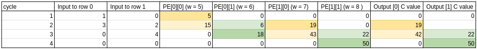

# CF05 CMAN: Weight stationary Systolic array 
## task 1
A: activation
|||
|---|---|
|1|2|
|3|4|
B: Weights
|||
|---|---|
|5|6|
|7|8|

PE- Physical element Preload weight stationary
|||
|---|---|
|5|6|
|7|8|

## task 2
A: activation transposed to match expected math with systolic array PE
|||
|---|---|
|3|1| 
|4|2|
+ input values enters the systolic array from the top of the original A aray
+ this array just rearange to have a more clear visual understanding if pushing from left to right
+ input of the systolic_trace table below was changed to fit the Math (expected calculation below)
+ the input direction of Activation array into the systolic array was orignally unknown.
+ colors to indicate vertical passing of partial product to coresponding PE every cycle.

## flow issues require reviewing expected output to get correct trace table
Dot product review:  A * B  
a b * A B = aA+bC  aB+ bD   
c d   C D = cA+dC  cB+ dD   
### expected calculation:  
|||
|---|---|
|1x5 + 2x7 | 1x6 + 2x8|
|3x5 + 4x7 | 3x6 + 4x8|  
### partial products:    
|||
|---|---|
|5 + 14 | 6 + 16|
|15 + 28 | 18 + 32|

C = [[19, 22], [43, 50]].

- **Insight**: one matrix must be transposed. Makes sense to transpose weights since this needs to be done once but problem states fixed PE to original weights so we transpose A, A dot B is not the same as B dot A. Pushing left to right without transpose result in an initial 2x5 incycle 1 which does not make sense for our Expected matrix calculation.
- **Insight**: since we fix PE to weights, put in what ever number for input to make the systolic array 2d pipeline make sense. If the math makes sense then we adjust our hardware to fit the math. We don't know how input A is pushed/transposed.

## task 3: 
### (a) total MAC operations performed
16 total MAC operations perfromed, 8 PE passes, first initial multiplication accumulates with 0. In terms of N this would be 2N^3.
### (b) number of times each input value is reused
each input is reused 2 times in a N=2 array, if N is larger, each input is reused N times, which is all we need for a matrix matrix multiplication.
### (c) number of off-chip memory accesses for A, B (as inputs), and C (as output).
Each matrix is accessed once. 3 matrix so 3N^2.

## task 4:
If this was output-stationary instead, the outputs would stay fixed in the PE and data flow would be much simpler to imagine/visualize.