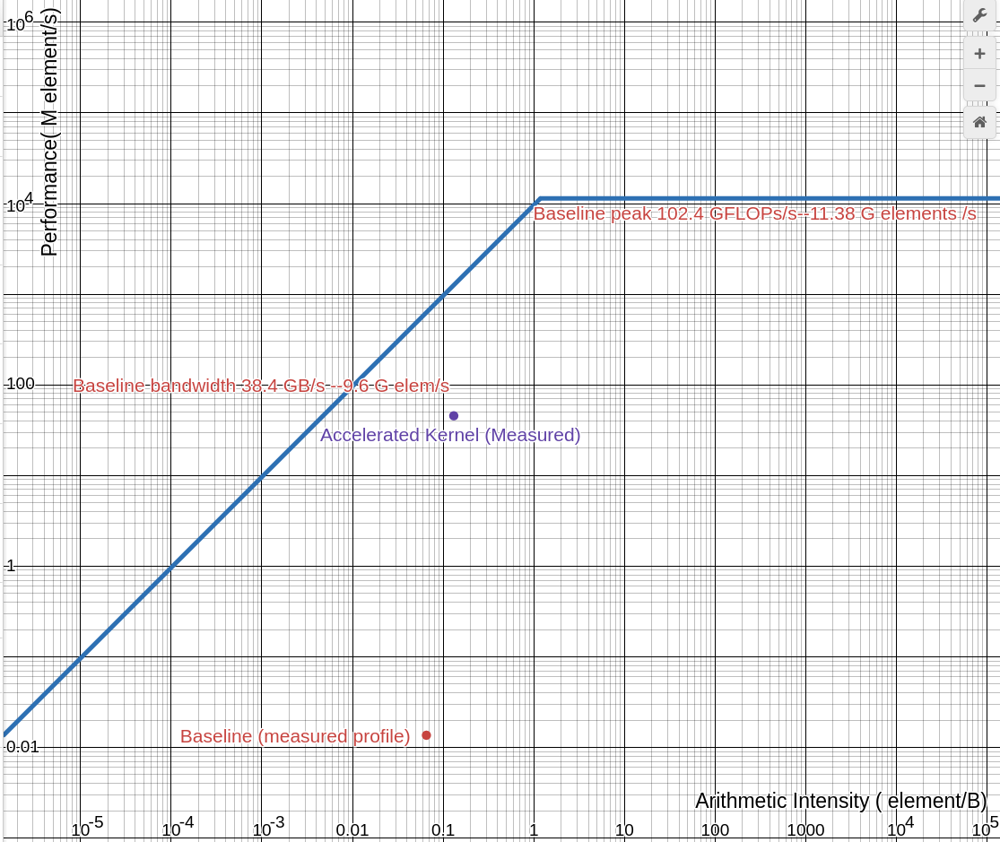
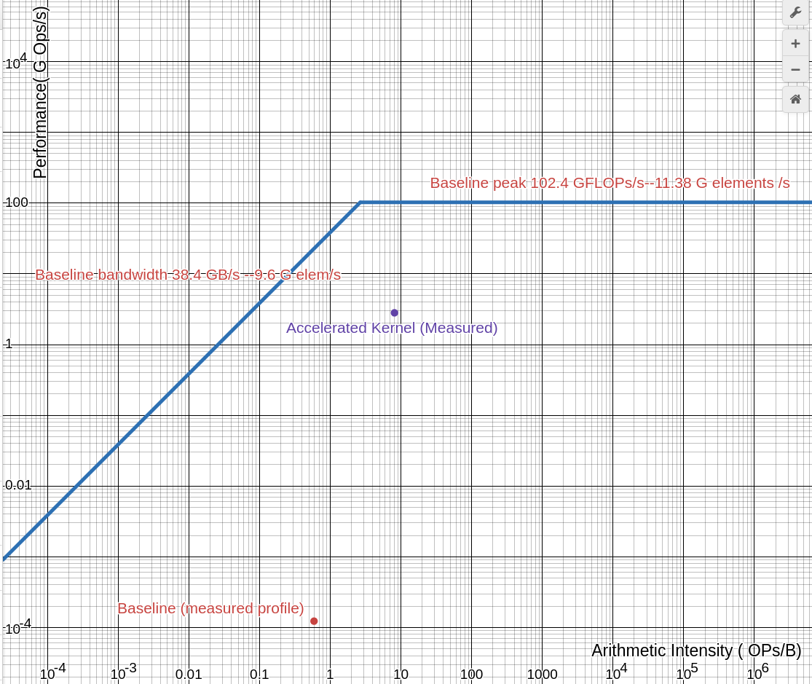

## AI calculation 
```
====Baseline=====
Bytes = shape * bytes/element * 2 (in and out) 
2^17 * 2^3 (fp64) * 2 = 2 MB
measured throughput : 13.647 K elem/s & 122.8 K flops/s
elements = 2^17
OPS = 2^17 * 9 = 1179648
AI (ops/B) = 1179648/2 MB = 0.5898 OPs/B
AI (elem/B) = 2^17 / 2MB = 0.06553 elem/B

|Throughput| 13.647 K elem/s| 
|Throughput| 122.8 K flops/s| 

====accelerator=====
Bytes = shape * bytes/element * 2 (in and out) 
2^17 * 2^2 (fp32) * 2 = 1 MB
AI (OPs/B) = 2^17*62 /1 MB =  8.12 OPs/B
AI (elem/B) = 2^17 / 1MB = 0.1310 elem/B

PCIe 4 Hardware 38.4 GB/s 
old hardware peak 102.4 GFLOPs/s / 9 (flop/element) = 11.38 G elements /s 


|Measured Throughput| 45.45 M elem/s| 
|Throughput| 2.8179 G Ops/s| 
```
These AI calculations are ploted against the Measured throughput of the baseline and kernel. 62 int operations was counted for the accelerator, though most are comparators for PWL gelu.
# Roofline plot
## roofline in elements

## roofline in Ops

### Roofline notes 
Since the algorithm in hardware (62 ints ops) is vastly different than the (9 float ops) in software Analysis was done in element/B for better comparison between the two points.

## Roofline analysis

Analysis of roofline plot indicates several orders of magnitude performance increse for the accelerated kernel with just one pipeline. This is with only one pipeline where there is room for AXIstream width to expand (and run more parallel kernels). AXI stream width expansion and kernel parallelization can be done up until axi stream of the module's internal approaches that of the host PCIe. While simulation of chip memory buffer passes, we could not include that module in this simulation because it had not yet been synthesized. In its current state, this would represent an axi stream interface to the host and not PCIe. While the roofline plot using ops shows that the measured accelerated kernel passes into compute bound teritory, this misrepresent the fact that the accelerated kernel is done on custom hardware and is not bound by the host CPU baseline peak. In addition this generalizes OPS since the baseline peak and orignal profile was in FLOPS and the custom hardware perfroms many int operations. Keeping representation of performance as elements more honestly states the current difference. The shift in AI for the accelerated kernel to the right is because we quantize from fp64 to fp32 in software before sending the signal (the Bandwith elements/s treats each element as 4 bytes (fp32)). The measured time of quantization to and from the kernel was included in the calculations. 