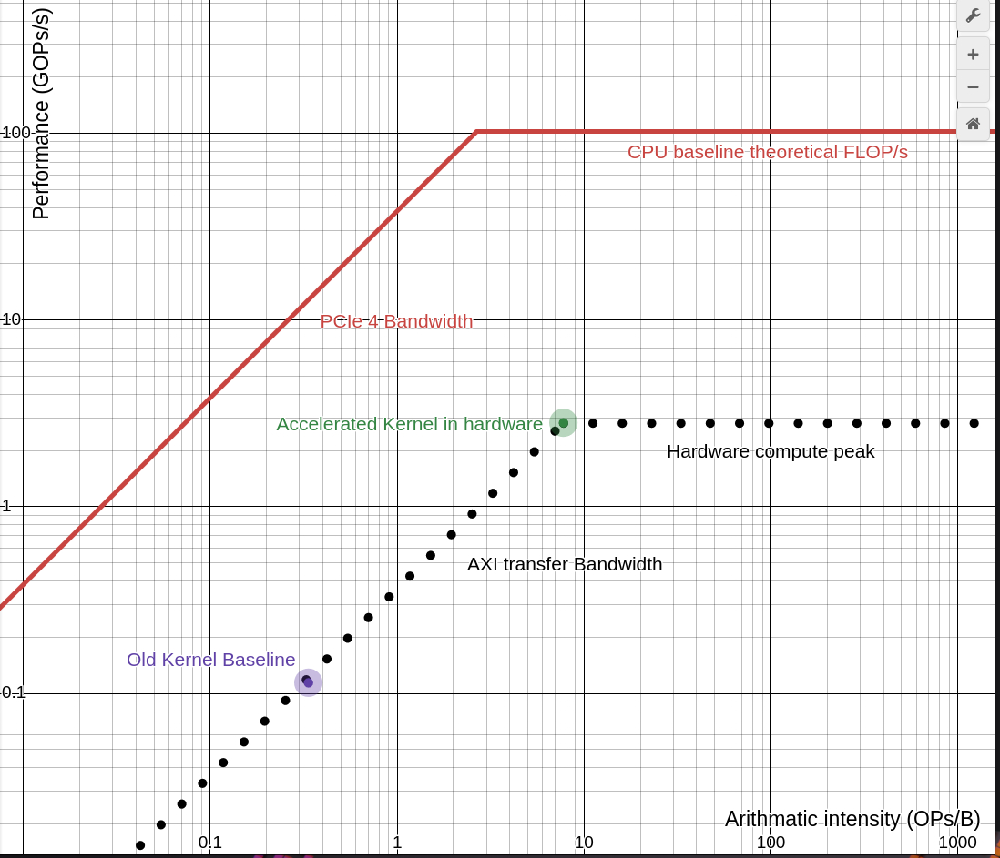
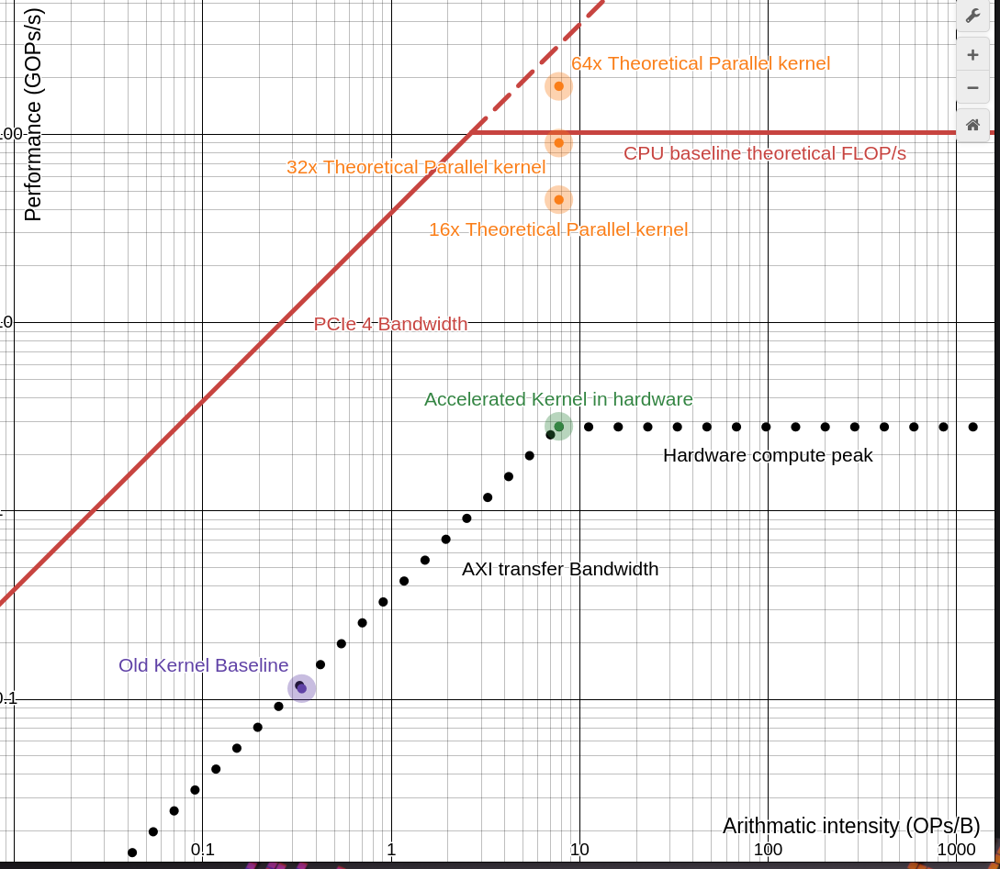

#
1. Dominant kernel of transform_lm.py was determined to be Gelu at the small configuration of batch size 8, sequence length 64, d_ff 256.
2. Original invocation of the kernel does the following operation:  
`
0.5 * x * (1.0 + np.tanh(np.sqrt(2.0 / np.pi) * (x + 0.044715 * x ** 3))) `

This evaluates to 2 f.add, 6 mul, 1 f.division, 1 square root, 1 tanh. 11 floating operations for original implemnetation. My design is a float to p16.16 conversion kernel operaiton, and back conversion.  


manual count
The core_kernel performs 23 comparisons, 1 sub, 1 multiply, 1 add, 1 shift. these are integer operations. f32_to_p16: 10 comp, 2 add,1 sub,1 shift.
p16_fp32: 14 comp, 5 shift, 3 add, 1 sub. in total the Kernel does (integer) 47 comparisons, 3 sub, 6 add, 1 multiply, 7 shifts. totalling 64 int operations across 12 cycles/stages. for each element

claude count:
| Type | fp32→q16 | compute_core | q16→fp32 | **Total** |
|---|---|---|---|---|
| MUL | 0 | 1 | 0 | **1** |
| ADD | 2 | 1 | 3 | **6** |
| SUB | 1 | 1 | 1 | **3** |
| SHIFT | 1 | 1 | 5 | **7** |
| DIV | 0 | 0 | 0 | **0** |
| **Arithmetic total** | 4 | 4 | 9 | **17** |
| Comparisons (functional) | 1 | 38 | 6 | **45** |
| Comparisons (range/sat) | 4 | 2 | 0 | **6** |

total operations that should count as int operations 45+17 = 62

input shape is batch*sequence*d_ff=2^3*2^6*2^8= 2^17 element 

2^17 * 62 = 8,126,464 INTOPs

3. The off chip transfer input shape is batch*sequence*d_ff=2^3*2^6*2^8= 2^17 element (fp32) 

Bytes per input = 2^17 * 2^2 = 2^19 = 512 KB. For gelu only the input shape is sent, and output revieved. `512 KB x 2 = 1 MB` transfered across the interface. No data is reused.


4. AI for kernel is INTOPs/Bytes. 

## Arithmatic intensity
```
8,126,464 INTOPs / 2^20 Bytes= 7.75 INTOPs/B 
```

### compute peak
the conversions each have 4 stage, and the core kernel has 4 stages. each stage operation takes 22 ns. it takes pipeline_depth - 1 to fill the pipeline and every operation after that would take 22 ns. 
the input shape  was determined to be 2^17 elements. 
```
Total cycles = 2^17 + (12 -1) = 131083
total time = total cycles * 22 ns = 131083 * 22 = 2,883,826 ns
INTOP/s = 8,126,464 INTOPs / 2,883,826 ns = 2,817,945,326.8 = 2.817 BOPs/s
```


### Bandwidth calculation
Interface is expected to go through pcie (31.5 GB/s pcie4, 15.75 pcie3) and axi stream.

so we choose the slower bandwidth of the two.
our own axi stream sends 4 bytes per clock tick in and out so this would be 8 bytes per 22 ns 
```
axi stream speed based on my Openlane clock speed that meets timing: 
8 / 22 = 363,636,364 Bytes/s 
```
Note: 22ns (~45.5 MHz) is the clock limit of a 32x32 multiplier with our 130nm process, SKY130. the clock can be shorter and axi can be faster on a smaller process. Data bus for axi stream can be widened (to match pcie speed) and processed with more instances of our core kernel.

In this case the axi stream is expected to operate at a slower speed than pcie. at 364 MB/s

### ridgepoint 
```
compute peak / bandwidth = 2,817,945,326.8 / 363,636,364 = 7.749 intOPs/B
```

In this calculaiton bandwith and compute peak is based on our created hardware. The ai kernel sits exactly on the ridgepoint of the hardware. 

old comparisons of baseline laptop was retrieved. 

|||
|-|-|
|Peak Performance| 102.4 GFLOPs/s|
|Peak Bandwidth| 38.4 GB/s|

## Roofline plot


This plot compares the old kernel ops (floats) and the new hardware acceleration (ints) ops. The algorithm changes such that the hardware implementation uses vastly different operations. 

5. In our acceleration kernel the hardware can be faster than the CPU compute roofline compute peak since it is different components clocked at different rates. This shows the current with no parellism. AXI stream interface width can be expanded to handle more parallel gelu_fp32 cores. The current design is neither limited by hardware compute or bandwidth Since we used a conservative aproach to make sure we are within limits. 

As previously mentioned the one best strategy, if this kernel were to be used in PCIe interface, is to make parallel pipelines. The compute peak and axi transfer bandwith is not fixed since this is the exact hardware that we are modifying. One note, the peak of the acceleration is limited by PCIe bandwidth we can only set parallel lines of our kernel up to the PCIe limit. 

AI = 8,126,464 INTOPs / 2^20 Bytes= 7.75 INTOPs/B 
BW = 8 / 22 = 363,636,364 Bytes/s 

if we add more parallel cores, bandwidth and AI would scale linearly. 

At 16 parallel originally proposed GELU cores we would have: 
```
BW 363,636,364 Bytes/s * 16 = 5.818 Bytes/s
AI = 7.75 INTOPs/B fixed stays the same. 
Performance peak = 2.817 BOPs/s * 16 = 45.072 BOP/s
```
Even at 64 parallel components, the axi would push below our PCIe, at around `0.363*64 =23.2 GB/s` peak performance would then be `2.17 *64 = 180 BOPs/s` but much of this would depend on internal routing.



Our speed would just be dependent on transfer hardware (and our hardware peak performance) instead of the CPU peak performance. This graph shows the effect of expanding axi stream Width to `8*64 = 512 bytes` (this theoretical does not consider DMA and memory hardware overhead)