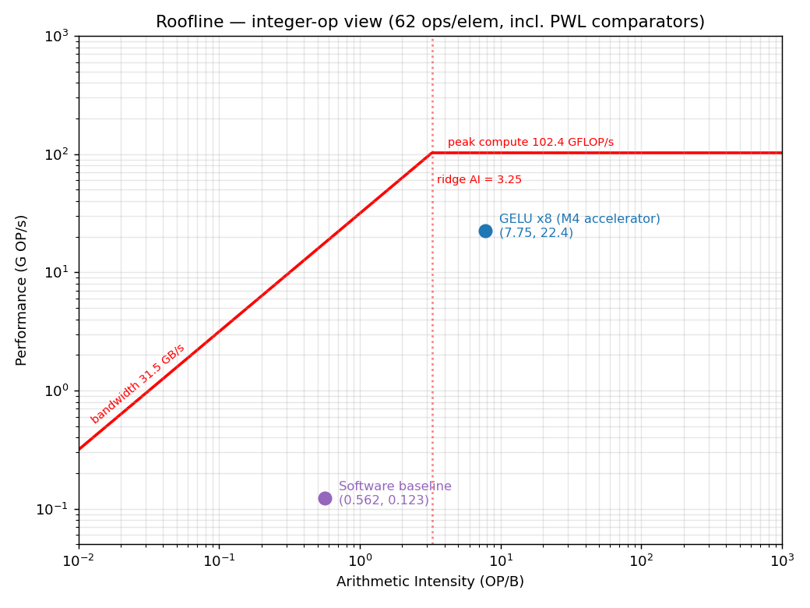
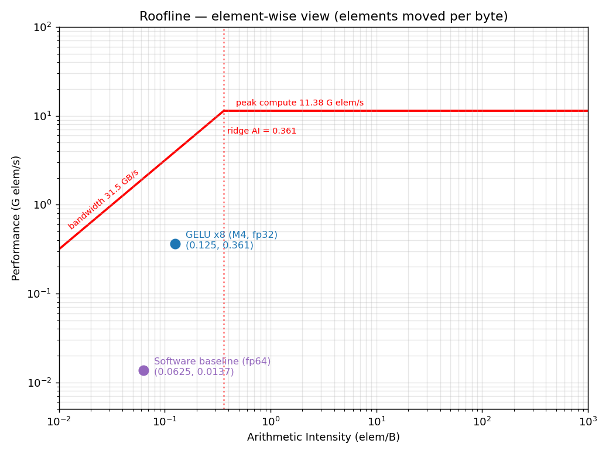

# GELU Accelerator — Benchmark Results

Workload (all sections): M1 transformer, small config, 2 layers, B=8, T=64,
d_ff=256, seed=42. One GELU activation tensor per layer FFN; **2 layers →
2^18 = 262,144 GELU elements** total. All accelerator rows are **measured
(cycle-accurate Icarus)** from the fresh in-loop co-sim logs in `m4/sim/`
(captured under the current module names; provenance tails in
`bench/sim_output/`).

Baseline Hardware
| Parameter | Value |
|-----------|-------|
| OS | linux 6.17.0=14-generic|
| Distribution| Ubuntu 24.04.1 |
| Python version | 3.12.3 |
| CPU | i5-8365U CPU @ 1.60GHz|
| Memory | 16 GB dual channel 2400 MHz|
|Peak Performance| 102.4 GFLOPs/s|
|Peak Memory Bandwidth (DDR4 dual-ch)| 38.4 GB/s|
|Peak Link Bandwidth (PCIe4 x16, roofline roof)| 31.5 GB/s|
| Batch Size | 8 |
| Sequence Length | 64 |
| D_ff | 256 |

---

## 1. Summary comparison

**Time and Speedup include the host fp64↔fp32 cast for every accelerator row.**
`Time (HW+cast)` = (HW streaming time, or DMA round-trip time, in ns ÷ 1e6) +
**0.456 ms** deterministic host cast, applied uniformly (the host does the same
cast work regardless of lane count). `Speedup` = **19.208 ms ÷ Time(HW+cast)**,
where 19.208 ms is the element-count-matched software baseline (9604 ms ÷ 500
forwards). Throughput / cycles-elem / AXI-BW are HW-only kernel metrics.

| Configuration | Time (HW+cast) | Throughput | cycles/elem | AXI BW (in+out) | Speedup | Synthesizable |
|---------------|----------------|------------|-------------|-----------------|---------|---------------|
| Software baseline (per forward) | 19.208 ms | 13.65 M elem/s | — | — | 1× | — |
| 1 pipeline, direct AXI-Stream | 6.228 ms | 45.42 M elem/s | 1.0009 | 363.3 MB/s | 3.08× | Yes |
| 8 pipelines, direct AXI-Stream | 1.182 ms | 361.17 M elem/s | 0.1259 | 2889.3 MB/s | 16.3× | Yes |
| 16 pipelines, direct AXI-Stream | 0.821 ms | 717.46 M elem/s | 0.0634 | 5739.7 MB/s | 23.39× | violations |
| 32 pipelines, direct AXI-Stream | 0.641 ms | 1415.83 M elem/s | 0.0321 | 11,326.7 MB/s | 30.0× | violations |
| 1 pipeline, wide DMA, serial | 12.351 ms | 22.04 M elem/s | 2.0625 | 176.3 MB/s | 1.56× | violations |
| 8 pipelines, wide DMA, serial | 1.943 ms | 176.31 M elem/s | 0.2578 | 1410.5 MB/s | 9.89× | N/A |
| 16 pipelines, wide DMA, serial | 1.199 ms | 352.62 M elem/s | 0.1289 | 2820.9 MB/s | 16.01× | N/A |
| 32 pipelines, wide DMA, serial | 0.828 ms | 705.23 M elem/s | 0.0645 | 5641.9 MB/s | 23.2× | N/A |

**Synthesizable** = an OpenLane2 RTL→GDS run was taken to clean post-route
sign-off. **Yes** = hardened, timing/DRC/LVS clean (x1, x8 direct stream — see
§2). **violations** = attempted but did not converge — timing and/or routing
violations (x16 and x32 direct stream over-congested; x1 DMA had timing/routing
violations). **N/A** = not attempted (the wide-DMA x8/x16/x32 round-trip configs
were simulated for throughput only, never pushed through synthesis).

Every row above is **measured (cycle-accurate Icarus)**. The DMA path is driven
**serially** in the testbench (per burst: write → `stream_enable` → read, no
overlap), so its cycles/elem (2.06×) reflects the non-overlapped test pattern,
not a hardware limit — a double-buffered DMA controller would hide the
serialization and recover roughly the direct-stream rate, link-bound thereafter.
At high lane counts the **fixed 0.456 ms host cast becomes the system
bottleneck**: the 32-lane direct stream sustains 1.4 G elem/s in HW, yet the
cast is 71% of its 0.641 ms end-to-end time, capping the speedup at ~30×.


---

## 2. Synthesis results — post-route hardening (streaming, no DMA)

Post-route OpenLane2 (sky130A / sky130_fd_sc_hd) results for the two **direct
AXI-Stream** kernels — no DMA buffers in the hardened design:

- **x1** — `gelu_top`, 1 pipeline, 32-bit stream (`synth/gelu_x1s/`).
- **x8** — `gelu_top` @ `GELU_NUM_LANES=8`, 256-bit stream — the graded M4
  deliverable at `synth/` root. The pragmatic parallel target (x16/x32 over-congest).

The design is a single parameterized module **`gelu_top`** (`rtl/top.sv`, lane
count set by the `GELU_NUM_LANES` define); the synth configs
(`synth/config_*.json`) all target `DESIGN_NAME: "gelu_top"`. The x8 reports at
`synth/` root were regenerated from run `RUN_2026-06-07_14-45-32` so every header
reads `gelu_top` (an earlier run used the legacy name `gelu_top_x32`; the rerun
is numerically identical, differing only in that name string).

Both clock at **22 ns (45.45 MHz)** and **meet timing at every corner** (setup
and hold WNS = 0, TNS = 0, zero violating register-to-register paths). Other
attempted synthesis runs that had timing or routing violations include the x16
and x32 lane configurations, and the DMA configuration with x1 lane.

| Metric | x1 (1 lane, `synth/gelu_x1s/`) | x8 (8 lanes, `synth/` root) | x8 / x1 |
|--------|---------------------|----------------------|---------|
| Module | `gelu_top` (32-bit) | `gelu_top` @ NUM_LANES=8 (256-bit) | — |
| **Area** — synth cell area (µm²) | 90,470.52 | 676,371.19 | 7.48× |
| Area — post-route placed std-cell (µm²) | 95,128.7 | 738,475 | 7.76× |
| Area — die area (µm²) | 195,132 (util 52.7%) | 1,733,820 (util 43.7%) | 8.89× |
| Flip-flops (dfxtp_2) | 1,142 | 8,451 | 7.40× |
| Total cell count | 7,704 | 58,045 | 7.53× |
| **Power** — total @ nom_tt (1.8 V) | 30.22 mW | 228.37 mW | 7.56× |
| Power — internal / switching / leakage | 15.04 / 15.18 mW / 60 nW | 109.77 / 118.60 mW / 0.50 µW | — |
| Power — high-V bound (ff, 1.95 V) | 35.23 mW | 267.8 mW | 7.60× |
| **Timing** — worst setup slack (nom_tt) | +11.826 ns | +11.382 ns | — |
| Timing — worst hold slack (nom_tt) | +0.301 ns | +0.284 ns | — |
| Timing — worst setup (all corners) | +1.440 ns (max_ss_100C_1v60, MET) | +0.468 ns (max_ss_100C_1v60, MET) | — |
| Timing — worst hold (all corners) | +0.111 ns (min_ff_n40C_1v95, MET) | +0.087 ns (max_ff_n40C_1v95, MET) | — |
| Setup / hold TNS (all corners) | 0 / 0 | 0 / 0 | — |
| Setup / hold violating paths | 0 / 0 | 0 / 0 | — |
| Sign-off DRC / LVS / XOR / PDN | all 0 (IR-drop 5.3 mV) | all 0 | — |

**Notes.** Area and power scale ~lane-count (≈7.5×, not 8×) because the
AXI-Stream/Lite wrapper, FIFO, and counters are scalar — only the 8 `gelu_fp32`
datapaths replicate. Combinational logic dominates (~73% area, ~84–86% power),
driven by the per-lane 32×32 multiply in `compute_core` stage 3. Timing is
comfortably met (critical path ~10 ns vs 22 ns clock). The only DRVs are
max-cap/max-slew, small at nom_tt and large only at the extreme
`max_ss_100C_1v60` sign-off corner. Power activity factors are OpenROAD defaults
(toggle 0.1), so figures are a valid relative baseline (±10–20%).

### 2.1 — Energy comparison

**Method:** `E = P_synth × t`, with `P_synth` the OpenLane post-route power
(nom_tt) and `t` the measured **HW streaming time** (the host cast runs on the
CPU and is excluded from chip energy). Only the two hardened designs (x1, x8)
have a synthesized power number.

| Design | Power (nom_tt) | HW time | Energy / forward | Energy / element |
|--------|---------------:|--------:|-----------------:|-----------------:|
| `gelu_top` (x1) | 30.22 mW | 5.772 ms | ≈174 µJ | ≈0.66 nJ |
| `gelu_top` @8 (x8) | 228.37 mW | 0.726 ms | ≈166 µJ | ≈0.63 nJ |

(Energy to ~3 sig figs; the underlying power is an OpenLane estimate with
default activity factors, so its real uncertainty is ±10–20%.)

**Parallelism is ~energy-neutral.** x8 power is 7.56× x1 while its runtime is
~7.95× shorter, so energy per element is essentially unchanged (≈0.63 vs
≈0.66 nJ — x8 is ~5% lower): going wider trades area for time at constant
energy, buying the ~8× speedup "for free" energetically (leakage is ≈0.5 µW,
negligible).

#### vs the software baseline (estimated)

The software baseline's energy was **not directly measured** — the run predates
any RAPL / package-power telemetry capture, so there is no per-call wattage. We
bound it from the CPU's rated TDP instead. The baseline ran on an **Intel Core
i5-8365U** (Whiskey Lake-U, **15 W base TDP**; cTDP 10–25 W), taking **19.208 ms
per forward**:

```
E_sw (per forward)  ≈ TDP × t  = 15 W × 19.208 ms ≈ 0.288 J  = 288 mJ
E_sw (per element)  = 288 mJ / 262,144            ≈ 1.10 µJ/elem
```

| | Energy / forward | Energy / element | vs SW |
|--|-----------------:|-----------------:|------:|
| Software baseline (i5-8365U, 15 W TDP est.) | ≈288 mJ | ≈1.10 µJ | 1× |
| `gelu_top` (x1) | ≈174 µJ | ≈0.66 nJ | **≈1660× less** |
| `gelu_top` @8 (x8) | ≈166 µJ | ≈0.63 nJ | **≈1740× less** |

So the accelerator uses **~3 orders of magnitude less energy** per forward pass.
**Caveats:** TDP is a thermal envelope, not actual draw — the CPU almost
certainly does not sit at the full 15 W during the GELU-only work, so the true SW
energy is somewhat lower and this is an **upper bound**. The HW side is the
OpenLane post-route estimate (chip dynamic+leakage, ±10–20%, host cast excluded).
The two are therefore not measured the same way; the comparison is an
order-of-magnitude argument, and the ~1700× gap is far larger than the combined
uncertainty.

---

## 3. Roofline — arithmetic intensity & attained performance

Each config is a point at **(arithmetic intensity, attained performance)**.
HW moves **8 B/elem** (FP32 in + FP32 out), so the arithmetic-intensity columns
are **constant down all HW rows** — parallelism changes neither ops/elem nor
bytes/elem, only the attained OP/s. `Attained @62 = (M elem/s) × 62 ÷ 1000`
G OP/s.

The **62 ops/elem** convention counts *all* per-element work the kernel performs,
not just arithmetic: it includes the **PWL parallel comparators** (the segment-
select logic in `compute_core` that compares the input against the breakpoint
bounds to pick the active linear piece) **in addition to** the multiply/add/shift
arithmetic. Those comparators are real hardware and run every cycle, so the
62-op count reflects the silicon more honestly than an arithmetic-only tally.

| Config | elements/s | AI@62 (op/B) | AI (elem/B) | Attained @62 (G OP/s) |
|--------|-----------:|-------------:|------------:|----------------------:|
| Software baseline (fp64) | 13.65 M | — \* | 0.0625 \* | 0.123 G FLOP/s \* |
| x1, direct stream | 45.42 M | 7.75 | 0.125 | 2.82 |
| x8, direct stream | 361.17 M | 7.75 | 0.125 | 22.4 |
| x16, direct stream | 717.46 M | 7.75 | 0.125 | 44.5 |
| x32, direct stream | 1415.83 M | 7.75 | 0.125 | 87.8 |
| x1, DMA serial | 22.04 M | 7.75 | 0.125 | 1.37 |
| x8, wide DMA serial | 176.31 M | 7.75 | 0.125 | 10.9 |
| x16, wide DMA serial | 352.62 M | 7.75 | 0.125 | 21.9 |
| x32, wide DMA serial | 705.23 M | 7.75 | 0.125 | 43.7 |

\* Software row: 9 FLOP/elem over fp64 (16 B in+out) → AI = **0.56 FLOP/B**
(= 0.0625 elem/B); a floating-point point, not directly comparable to the
integer-op HW rows.

**Roofline baseline hardware:** link bandwidth **31.5 GB/s** (PCIe4 x16), peak
compute **102.4 GFLOP/s** (= 11.38 G elem/s after ÷ 9 FLOP/elem), **ridge ≈
102.4 / 31.5 = 3.251 FLOP/B**.

Where the design sits relative to the ridge (= 3.251 FLOP/B):
- **elem/B = 0.125** is **below** the ridge → in the per-element view the kernel
  is **memory/bandwidth-bound**.
- **@62 = 7.75 op/B** is **above** the ridge → nominally compute-bound; but the
  baseline roof is FLOP-based while the @62 column counts integer ops (arithmetic
  + PWL comparators), so that comparison is not strictly like-for-like.

Either way the *software baseline* (13.65 M elem/s, 0.123 GFLOP/s) sits far below
both roofs. Keep the ridge in the **same unit** as the points: the **op/B**
column pairs with an attained-**OP/s** plot, and the **elem/B** column (0.125)
pairs with an **elements/s** plot.




---

## 4. Host fp64↔fp32 conversion cost (deterministic cProfile measurement)

Every speedup above adds a host-side fp64↔fp32 round-trip cast (the cost of
feeding the FP32 accelerator from the fp64 model). Earlier sections used the
per-run wall-clock `acc["conv_us"]` figure from each cocotb tb, which is noisy
(it varied 0.267–0.867 ms across otherwise-identical runs because cocotb runs
the Python tb inside the simulator process). To get a **single deterministic**
number we instead profile the cast in the base software: `cast_fp32_roundtrip()`
in `transformer.py` (`x.astype(np.float32).astype(np.float64)`, called once per
layer FFN, before GELU) under `cProfile`.

**Measurement:** `python -m cProfile train.py --config small`, 10 repeats. The
`cumtime` of `transformer.py:28(cast_fp32_roundtrip)` over its **1000 calls**
(500 forward passes × 2 layers), in seconds:

| Run | 1 | 2 | 3 | 4 | 5 | 6 | 7 | 8 | 9 | 10 | **avg** |
|-----|---|---|---|---|---|---|---|---|---|----|---------|
| cumtime (s / 1000 calls) | 0.225 | 0.224 | 0.229 | 0.228 | 0.227 | 0.230 | 0.231 | 0.228 | 0.229 | 0.227 | **0.2278** |

**Average = 0.2278 s for 1000 calls** (131,072-element round trip per call).
Normalised to the benchmark unit:

```
per call (131,072 elems)      = 0.2278 s / 1000          = 227.8 us
per element                    = 227.8 us / 131,072       = 1.738 ns
per forward pass (262,144)    = 227.8 us × 2 calls        = 455.6 us ≈ 0.456 ms
```

**All speedups in §1 use this 0.456 ms cast** (one forward pass = 262,144
elements = the GELU workload of every config), replacing the noisy per-tb
`conv_us`. It is identical across configs because the host does the same cast
work regardless of how the kernel is parallelised — which is exactly why it
becomes the Amdahl bottleneck as the kernel speeds up .

---

## 5. PCIe DMA scaling projection (single → many pipelines)

The on-chip sims are clock-domain-ideal — PCIe is never modeled — so the
external link is the real throughput ceiling once the kernel is fast. This
section projects where that ceiling sits.

**Per-pipeline demand (measured):** 1 FP32/cycle @ 45.45 MHz = **181.8 MB/s per
direction** (in and out), 363.6 MB/s aggregate; 45.45 M GELU/s.

**PCIe Gen4 DMA — projected scaling** (16 GT/s/lane, 128b/130b encoding, per
direction, full-duplex; throughput = pipelines × 45.45 M GELU/s):

| Link | Theoretical BW/dir | Pipelines it can feed (÷181.8 MB/s) | Projected throughput (full fill) |
|------|--------------------|-------------------------------------|----------------------------------|
| x1   | 1.97 GB/s          | ~10                                 | ~0.49 G GELU/s                   |
| x4   | 7.88 GB/s          | ~43                                 | ~1.97 G GELU/s                   |
| x8   | 15.75 GB/s         | ~86                                 | ~3.9 G GELU/s                    |
| x16  | 31.5 GB/s          | ~173                                | ~7.9 G GELU/s                    |

Derate ~10% for TLP/header overhead (MPS-dependent) for a practical figure.
All values projected from link theory × synthesized 45.45 MHz throughput, not
measured. For reference, the 32-lane `gelu_top` design needs ~5.8 GB/s per
direction — comfortably fed by Gen4 x4 / Gen3 x8. So the kernel is **not**
interface-bound until well past 32 lanes on a mid-range link; below that, the
host fp64↔fp32 cast (§4) caps the system first.

---

## 6. Software baseline (no accelerator)

The reference all speedups divide into. Measured by running the M1 transformer
training loop and timing only the GELU work.

Parameters: `train.py --config small --steps 500`

| Metric | Value |
|--------|-------|
| Total execution time | 44.085 s |
| GELU time (full 500-step run, 1000 calls) | 9604 ms |
| **GELU time per forward pass (2^18 elems)** | **19.208 ms** ¹ |
| Throughput | 13.65 M elem/s |
| Throughput | 122.8 M OPS ³ |
| Memory-profiler result (GELU) | 294.477 MiB ² |
| Theoretical data volume (per forward) | 2 MB (2^18 × fp64) |

Notes:
- The 9604 ms is the GELU total over the **whole 500-step run**: `forward` is
  called **500×**, each does **2 layers** = **1000 `gelu` calls**, and every call
  runs on the full `(8, 64, 256)` FFN tensor = **2^17 = 131,072 elements**
  → **131,072,000 element-conversions** total. (Verified by instrumenting the
  call: 500 forwards × 2 = 1000 gelu calls, 2^17 each.)
- ¹ The accelerator/tb workload is **one forward pass = 2 layers = 2^18 =
  262,144 elements**. The element-count-consistent software baseline is
  therefore **9604 ms / 500 forwards = 19.208 ms per forward**, and **all
  speedups in §1 are computed against this 19.208 ms**, not the 9604 ms run
  total. (Earlier revisions divided the 9604 ms run total by one forward,
  inflating every speedup by exactly the 500-forward factor; corrected here.)
- Throughput = 131,072,000 / 9.604 s = 13.65 M elem/s (independent of slicing;
  also = 2^18 / 0.019208 s per forward).
- ² Memory profile: 2000.539 MiB − 1713.062 MiB = 294.477 MiB over 1000 calls
  → 0.294477 MiB per call.
- ³ Software counts **9 FLOP/elem**: 13.65 M × 9 = 122.8 M FLOP/s. (The hardware
  uses the integer-op convention of §3 — 62 ops/elem incl. PWL comparators — so
  the two are reported in their own units and are not directly comparable.)
- Bytes (per forward) = 2^18 × 8 (fp64) = 2 MB.

---

## 7. Detailed per-config measurements (hardware-only)

Every accelerator row, cycle-accurate from the in-loop co-sim logs in `m4/sim/`
(provenance tails in `bench/sim_output/`, raw numbers in `benchmark_data.csv`).
**HW time is kernel-only** — it excludes the 0.456 ms host cast that §1 adds for
the end-to-end speedup. For the direct-stream rows it is the AXI-Stream time; for
the DMA rows it is the full write→compute→read round-trip. Throughput / bandwidth
are HW-only kernel metrics.

| Config | Measured HW time | Throughput | AXI BW / dir | AXI BW total | GELU max error | GELU failures |
|--------|-----------------:|-----------:|-------------:|-------------:|---------------:|--------------:|
| x1, direct stream  | 5.772 ms  | 45.42 M elem/s   | 181.7 MB/s  | 363.3 MB/s    | 0.026311 | 0 / 262,144 |
| x8, direct stream  | 0.726 ms  | 361.17 M elem/s  | 1444.7 MB/s | 2889.3 MB/s   | 0.026311 | 0 / 262,144 |
| x16, direct stream | 0.365 ms  | 717.46 M elem/s  | 2869.9 MB/s | 5739.7 MB/s   | 0.026311 | 0 / 262,144 |
| x32, direct stream | 0.185 ms  | 1415.83 M elem/s | 5663.3 MB/s | 11,326.7 MB/s | 0.026311 | 0 / 262,144 |
| x1, wide DMA       | 11.895 ms | 22.04 M elem/s   | 88.2 MB/s   | 176.3 MB/s    | 0.026311 | 0 / 262,144 |
| x8, wide DMA       | 1.487 ms  | 176.31 M elem/s  | 705.2 MB/s  | 1410.5 MB/s   | 0.026311 | 0 / 262,144 |
| x16, wide DMA      | 0.743 ms  | 352.62 M elem/s  | 1410.5 MB/s | 2820.9 MB/s   | 0.026311 | 0 / 262,144 |
| x32, wide DMA      | 0.372 ms  | 705.23 M elem/s  | 2820.9 MB/s | 5641.9 MB/s   | 0.026311 | 0 / 262,144 |

**Accuracy is identical across all eight configs** (max error 0.026311, 0/262,144
over-threshold, and — from the same logs — 503/512 next-token argmax matches,
logits avg/max 0.015396/0.104763): the datapath is bit-identical regardless of
lane count or DMA, so parallelism and buffering change only *timing*, never the
numeric result.

---