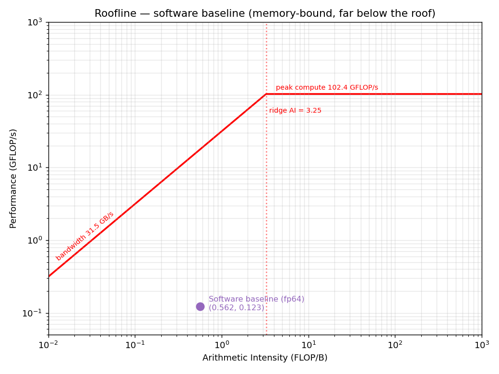
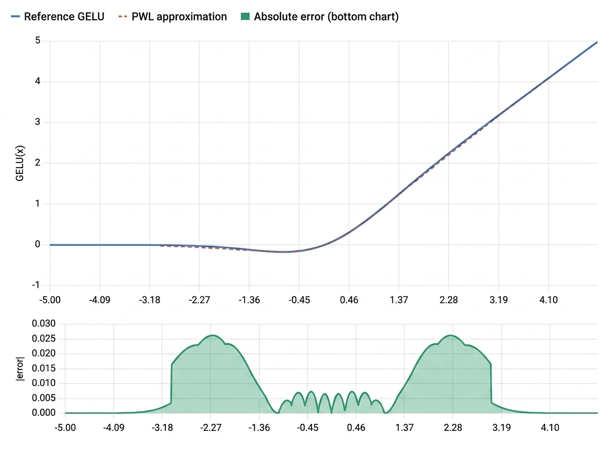
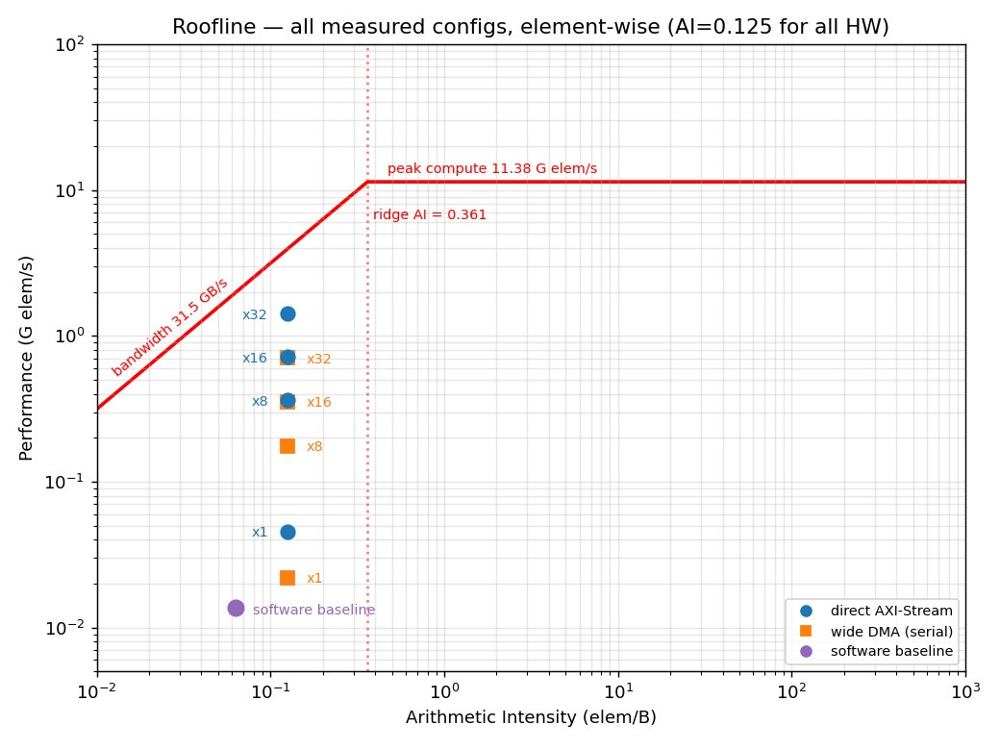
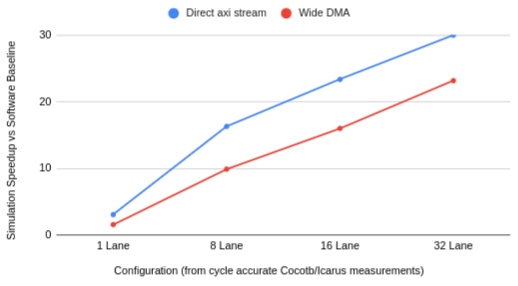

This is a draft look at the design_justification.pdf for the final submission. 
# I. Problem and Motivation
Activation Kernels are widely used across various AI algorithm, profiling of algorithm in M1 shows that GELU accounts for 21.4% of execution time (10.336 sec of 48.182 sec) of chat-gpt2 like transformer_ml algorithm. This GELU kernel was one of the the limiting factors in the transformer.py algorithm. Software acceleration and optimization would yield a much smaller change, hardware acceleration is expected to speed up the kernel by orders of magnitude. Custom hardware also allows speedup past the compute peak of our current hardware, the method of data transfer between the host and chiplet would be the main bottleneck. Accelerating complex kernels without first understanding a few fundamentals would result in over reliance of AI for the final product and missing of or skipping over core understanding. GELU was chosen for its relative simplicity as well as a strong candidate to learn about hardware design with AI. The main target of design philosophy to learn was pipelining, parallelization, data transfer bottleneck, workflow optimization, and measurement precision. In the original profiling, gelu_grad took slightly longer, GELU was chosen as a candidate instead because this is part of the inference forward loop. This means that some quantization and precision loss may be tolerated, with the backwards loop the precision loss however small is less predictable. 
# II. Roofline Analysis
Baseline hardware Bandwidth Memory = 38.4 GB/s 
Baseline hardware Bandwidth PCIe = 31.5 GB/s 
Baseline hardware Compute peak = 102.4 GFLOPs/s
Baseline kernel = 9.604s / 1000 calls
input shape = 8 * 64 * 256 = 2^17 elements
9 FLOPs per gelu element 
8 Bytes per element (fp64)
FLOPs total = 2^17 * 1000 * 9 = 1179648000
Bytes total (in and out)= 2^17 * 1000 * 8 * 2 = 2097152000
AI = flops/byte = 1179648000/2097152000 = 0.5625
Performance = Flops/s = 1179648000/9.604 = 122828821.324 = 0.1228 GFLOP/s
Ridgepoint AI = 102.4 / 31.5 = 3.251

Note: 9.604s comes from a rerun of profiling in M3. 

**Figure 1: Software-baseline roofline (fp64).** AI = 0.5625 FLOP/B, 0.123 GFLOP/s — well left of the ridge (3.251) and far below both roofs.

The target kernel was memory-bound (Figure 1), the bottleneck shifts when arithmetic intensity is increased over 3.251. The kernel is far below the roofline indicating room for optimization. Based on how far the kernel sits below roofline, it was decided to accelerate the kernel despite being in the memory bound side (compute bound kernels are generally better candidates for acceleration). 

# III. Precision and data format
It was deliberated in M1 (interface_selection.md) to use a quantized version of some sort for better data transfer since the kernel sits on the memory-bound side, fp64 to fp32 pre-bus conversion (and back) was the decided data format. At this point it was assumed that the main format for the core kernel would be fp32. Further prototyping with initial Gelu lead to int formats and Q16.16.

The data format used within the kernel is q16.16, however fp32 to q16.16 conversion modules are placed before and after the module. The software would do the fp64 to fp 32 conversion before and fp32 to fp64 after sending to the hardware. This was to ensure that low cost int math can be performed. This allowed clocking the module at a faster rate because a float multiplication would take much longer than int multiplication as a single pipeline unit. Additionally sending fp32 elements would take half as much bandwidth as fp64. Reusability was also another consideration, fp32 wrapper around the gelu core kernel allows it to interface with other fp32 modules as well. The time cost of fp64 to fp32 conversion is expected to be regained via the benefits in bandwidth. 

With the fp64 to fp32 quantization and hardware level fp32 to q16.16 conversion, the acceptable precision loss was set at 5% (Table 1). This was the pass level set in the testbench. Since the original hardware was in FP64 more aggressive quantization was not followed however it is assumed that for inference the precision can be dropped much lower without much loss to function. Final measured inloop max error due to Quantization steps and GELU PWL (piecewise linear approximation) is 0.026311 (Table 3).

# IV. Dataflow and architecture 
The Gelu kernel is element wise and the output only depends on the input and not the weights. There are no shared dependencies between operands or partial sum. There is no reason to hold onto any elements as it is passed through the custom GELU kernel. Therefore a streaming kernel will be functionally sufficient, memory is not necessary since there would be no reuse of data in the context of the GELU kernel alone.  In the context of PCIe however, DMA will burst data from host memory to a device memory. The later part was incorporated to model and measure real world implementation throughput but was not synthesized. 

 The final architecture is pipelined, 12 cycles are required to process one element. However each stage takes 22 ns, data is streamed in on every clock tick and one element can be processed every 22 ns in one pipeline when the pipeline is full. Parallelism is also applied to the pipeline in the final implementation 8 lanes are used. Openlane synthesis can perform on 8 lanes but as parallelism is increased, more routing congestion will result. The interface was changed such that parallelism is done via a parameter in interface.sv, this affects both AXI width and core instantiation count. 

The core consists of 12 stages, 4 stages for fp32 to q16 conversion, 4 steps for the core gelu, 4 stages for q16.16 to fp32 conversion. It was designed this way such that future additions to the core can occur between the q16 conversion and Gelu, and take advantage of using ints instead of float arithmetic units. As noted previously existing cores that uses fp32 can be instantiated above the conversion level. 

FP32 to Q16.16 conversion:
1 - unpack IEEE-754 and find overflows. 
2 - find the right shift amount from exponent
3 - barrel shift 64 bit vector for RNE (round nearest even)
4 - apply RNE rounding, two's complement, saturate.

The compute_core.sv stages:
5 - does a wide comparison in the first stage to find which boundary the input belongs to (this indexes s1_hits array later). 
6 - Predefined constants for slope, intercept, and segment base for x is set (values from s1_hits array entry). 
    The delta is determined from x and segment base.
7 - (critical path) the slope is multiplied against the delta, partial multiplication for q16.16. 
8 - completes multiplication for q16.16 with a shift and adds the intercept
    assigns max values if out of bounds or the calculated PWL position. 

Q16.16 to FP32  conversion:
9 - Extract sign bit and get magnitude
10 - Count leading zero and compute biased exponent
11 - left shift magnitude to normalize
12 - RNE Rounding; reassemble sign, exponent and mantissa. 

Gelu in compute_core.sv boundaries was set with manual calculations via google sheet, AI as a calculator is much less deterministic than manually calculating the exact points and boundaries (hardcoded predefined constants) of gelu curve for PWL approximation. The graph below shows a graph of PWL hardcoded values against the GELU curve with max errors around 0.026 (Figure 2). This is consistent with the max errors found in our inloop simulation of 0.026311 (Table 3).

**Figure 2: 20-segment PWL approximation vs the reference GELU curve.** Max error ≈ 0.026, consistent with the measured in-loop error of 0.026311.

# V. Hardware Interface

The original plan was to use PCIe, however anything that passes the floor bandwidth of 202.90 MiB/s works (CF02:Partition Rationale). Full internal memory integration was a goal. FULL PCIe DMA component was determined to be too complex to be achievable in this timeframe. This would also make the chip difficult to interface if the only interface was PCIe. AXI-stream interface was much better choice for intermodular communication and reuse as industry standard. The while not synthesized due to openlane constraints with memory, part of a DMA mm2s and s2mm with a 256x32 bit fifo buffer was created to simulate a PCIe interface as close to real timing as possible. Since there was no local data reuse in the GELU kernel it makes sense to leave it as a strictly streaming kernel instead of adding a memory component. The axi-stream was the final goal, however the inclusion of PCIe (DMA mm2s/s2mm as AXI master) is to demonstrate likely real world implementation and speedup differences. If this chiplet was incorporated on another chip with other AI accelerator kernels, there would likely be Memory and PCIe/DMA as master axi controller. 

The AXI stream pipeline is 256 bits wide in the final implementation. This supports 2 way communication (AXI does separate channels) of fp32 (4 bytes) times 8 lanes for a total measured bandwidth of 2889.3 MB/s at 22 ns clock. This is still far below the limits of PCIe of 31.5 GB/s, and theoretically more lands and a wider AXI interface can be used until AXI-stream reaches PCIe bandwidth. The RTL supports easy increments of lanes and axi width by one parameter NUM_LANES (`GELU_NUM_LANES compile define), though 8 lanes was found to be the synthesis limit of Openlane under given parameters. 

# VI. Verification 
Verification was bottom-up: each module was tested standalone at its hierarchy level before being integrated, so a failure localises to one block. The unit and interface testbenches (cocotb/Icarus) carry over from M2/M3; the full-model in-loop co-sims are the M3/M4 integration tests. AI was used to help generate the testbenches. Every test passes; full per-test detail is in `documents/TB_summary.md`.

Each testbench checks the RTL against an independent Python reference — bit-exact for the format converters, and within the 0.05 GELU error contract for the approximation (Table 1).

| Testbench | DUT (level) | # tests | What it verifies |
|-----------|-------------|:-------:|------------------|
| `tb_compute_core.py` | `compute_core` — Q16.16 PWL GELU | 5 | error sweep vs reference (max < 0.05), zero-crossing & saturation clamps, fixed pipeline latency, back-to-back streaming with no dropped samples, PWL segment-boundary off-by-one |
| `tb_fp32_to_q16.py` | `fp32_to_q16` — FP32→Q16.16 | 12 | zero/integer/fractional values, positive & negative overflow clamp, subnormal flush-to-zero, RNE half-LSB rounding, latency & throughput |
| `tb_q16_to_fp32.py` | `q16_to_fp32` — Q16.16→FP32 | 13 | exact integers, max/min magnitude, sign-bit handling, RNE ordering of adjacent values, latency & throughput |
| `tb_gelu_fp32.py` | `gelu_fp32` — full 12-cycle datapath | 7 | end-to-end error sweep (max < 0.05), edge/clamp cases, 12-cycle latency, streaming, PWL boundaries, FP32 specials (±inf / subnormal flush) |
| `tb_interface.py` | `gelu_axi_stream_interface` — AXI | 6 | AXI-Lite enable + read-only `NUM_LANES` CSR, `tready` gating while disabled, TLAST framing through latency, lossless backpressure, multi-beat accuracy sweep |
| `tb_top.py` | `gelu_top` — full model, direct stream | 1 | real M1 transformer forward with **every GELU on hardware**; per-element error < 0.05 and final-logit loop closure vs all-software reference |
| `tb_top_inloop_dma.py` | `gelu_dma_top` — full model, DMA path | 1 | same full-model check, but through the AXI4-MM DMA write→compute→read round-trip |

Table 1: Verification testbenches, hierarchy level, and coverage (45 tests total).

**Coverage spans three levels** — per-block (core + the two converters), per-datapath (`gelu_fp32`), and full-system (the two in-loop co-sims) — across all four lane counts (x1/x8/x16/x32). The in-loop result is consistent everywhere: **GELU max error 0.026311, 0 / 262,144 elements over threshold, 503/512 next-token argmax matches** the all-software model.

# VII. Synthesis Results
Synthesis of 1 lane and 8 lane Gelu was successful. Other configurations attempted synthesis but failed timing are 16 lanes, 32 lanes, 1 lane with DMA buffers. Both hardened designs close timing at the 22 ns (45.45 MHz) target clock with positive slack at every PVT corner and zero sign-off violations. The post-route OpenLane2 (sky130A / sky130_fd_sc_hd) numbers are in Table 2; the full reports are in `synth/` (config.json, timing_report.txt, area_report.txt, power_report.txt — the x8 design) and `synth/gelu_x1s/` (the x1 design).

| Metric | x1 (1 lane) | x8 (8 lanes) |
|--------|-------------|--------------|
| Synth cell area (Yosys) | 90,470.52 µm² | 676,371.19 µm² |
| Placed std-cell area | 95,128.7 µm² | 738,475 µm² |
| Die area (utilization) | 195,132 µm² (52.7%) | 1,733,820 µm² (43.7%) |
| Flip-flops (dfxtp_2) | 1,142 | 8,451 |
| Total cell count | 7,704 | 58,045 |
| Power — total @ nom_tt (1.8 V) | 30.22 mW | 228.37 mW |
| Power — high-V bound (ff, 1.95 V) | 35.23 mW | 267.8 mW |
| Worst setup slack (nom_tt) | +11.826 ns | +11.382 ns |
| Worst setup slack (all corners) | +1.440 ns (MET) | +0.468 ns (MET) |
| Worst hold slack (nom_tt) | +0.301 ns | +0.284 ns |
| Setup / hold TNS; violating paths | 0 / 0; 0 / 0 | 0 / 0; 0 / 0 |
| DRC / LVS / XOR | 0 / 0 / 0 | 0 / 0 / 0 |

Table 2: Post-route synthesis results for the two hardened designs.

**Dominant contributor.** Combinational logic dominates **area (~73%)** and **power (~84%)**. The cause is the per-lane 32×32 signed multiply in `compute_core` stage 3, which is also the **timing critical path** — data arrives at ≈12.3 ns, well inside the 22 ns clock. From x1 to x8, area and power grow **~7.5×** rather than 8× because only the eight `gelu_fp32` datapaths replicate; the AXI-Stream/Lite wrapper, FIFO, and counters are shared. The power figure is an OpenLane estimate that uses default switching activity (toggle 0.1), so treat it as a relative number (±10–20%).

**Power vs the software baseline.** The x8 chip draws **228.37 mW** (x1: 30.22 mW), against the software baseline's CPU — an **Intel i5-8365U rated at 15 W**. So the accelerator uses about **66× less power**, and it also finishes far sooner (0.726 ms of hardware streaming vs 19.208 ms on the CPU). Together this is a large energy gap: about **≈166 µJ** per forward on the chip (≈174 µJ for x1) versus an estimated **≈288 mJ** on the CPU (15 W × 19.208 ms) — roughly **~1700× less energy**. The CPU number is an estimate, not a measurement (no RAPL data), so it is an upper bound from the 15 W TDP, which the CPU rarely reaches during GELU-only work. The chip power is also an estimate (±10–20%, host cast excluded). Even so, the ~1700× gap is far larger than that uncertainty. See `bench/benchmark.md §2.1` for the full method.

# VIII. Benchmark Results

| Configuration | Time (HW+cast) | Throughput | cycles/elem | AXI BW (in+out) | Speedup | GELU max error | Synthesizable |
|---------------|----------------|------------|-------------|-----------------|---------|----------------|---------------|
| Software baseline (per forward) | 19.208 ms | 13.65 M elem/s | — | — | 1× | — (reference) | — |
| 1 pipeline, direct AXI-Stream | 6.228 ms | 45.42 M elem/s | 1.0009 | 363.3 MB/s | 3.08× | 0.026311 | Yes |
| 8 pipelines, direct AXI-Stream | 1.182 ms | 361.17 M elem/s | 0.1259 | 2889.3 MB/s | 16.3× | 0.026311 | Yes |
| 16 pipelines, direct AXI-Stream | 0.821 ms | 717.46 M elem/s | 0.0634 | 5739.7 MB/s | 23.39× | 0.026311 | violations |
| 32 pipelines, direct AXI-Stream | 0.641 ms | 1415.83 M elem/s | 0.0321 | 11,326.7 MB/s | 30.0× | 0.026311 | violations |
| 1 pipeline, wide DMA, serial | 12.351 ms | 22.04 M elem/s | 2.0625 | 176.3 MB/s | 1.56× | 0.026311 | violations |
| 8 pipelines, wide DMA, serial | 1.943 ms | 176.31 M elem/s | 0.2578 | 1410.5 MB/s | 9.89× | 0.026311 | N/A |
| 16 pipelines, wide DMA, serial | 1.199 ms | 352.62 M elem/s | 0.1289 | 2820.9 MB/s | 16.01× | 0.026311 | N/A |
| 32 pipelines, wide DMA, serial | 0.828 ms | 705.23 M elem/s | 0.0645 | 5641.9 MB/s | 23.2× | 0.026311 | N/A |

Table 3: Measured throughput, speedup vs the software baseline, and GELU accuracy for every config (Figure 6 plots the speedups).

M3/CF07 Theoretical speedup estimation of 3584.34x was from an erroneous calculation due to misinterpretation of the software gelu. This did not take into consideration that gelu was ran 1000 times instead of 1 time over 9.604 seconds. The corrected theoretical speedup in this case would be 3.584x, this number is inline with our 1 lane speedup. The measured throughput and speedup also considers a 0.2278 per gelu/0.456 ms per forward loop measured cost of fp64->fp32->fp64 conversion, in addition to any measured slowdown from the interface. The slowdown is more evident when compared with dma input and output fifo buffers (256 elements deep, width matching bus width). 

After acceleration, int ops was used in the Kernel so the AI must be changed to int ops. Since the algorithm changed as well, roofline in element/s was a better way to show improvements by the ai kernel (Figures 3-5). Figure 5 shows the scalability due to parallelization, once AXI-stream widening and parallelization reaches PCIe another option is to further quantize the kernel inputs To shift the AI to the right again. The speedup comparison in figure 6 shows that having the PCIe/DMA layer would reduce the speedup in real world implementations, however on-chip parallelization yields linear speedup return up to the measured point (32 lanes). However parallelization does come with more routing and area cost. It was very difficult to simulate synthesis (openlane) for greater parallelization since place and route time greatly increased the x16 run that failed took more than 5 hours. 

**Figure 3: Accelerator roofline, integer-op view.** Measured x8 design at AI = 7.75 OP/B (62 ops/elem, incl. PWL comparators).

**Figure 4: Accelerator roofline, element-wise view.** The x8 design at AI = 0.125 elem/B.

**Figure 5: Element-wise roofline of all measured configs** (x1/x8/x16/x32, direct stream + wide DMA).

Figure 6: Speedup comparison of Lane count and likely real-world slowdown due to DMA buffering. 

# IX. What did not work

 The original intent was to incorporate a memory module to match the complexity for a graduate level project. Memory was an issue that was evident in Openlane which was not usually present in Vivado. Small memory inference was okay but large memory structures required a more complex workflow of instantiating a blackbox sram from openmemory. Even two 256x32 inference with the core module resulted in routing violations and long synthesis time. After reflection on the fact that gelu had no data reuse, adding memory to the module would not yield noticeable return unless a DMA burst and PCIe was tangible in simulation. Actual practice was much more difficult. A FIFO mm2s and s2mm for a part of DMA was attempted, but this was not synthesizable. This was kept as simulation for a more realistic speedup measurement if the module was passed through to PCIe. DMA mm2s FIFO and s2mm FIFO grew in width based on lane count, but has a static depth of 256 elements.

Attempt of stretch goal to add a weight stationary systolic array was not finished in time. While the systolic array exists in M5, matching the 8 lane gelu, Tiling and memory needs to be accomplished before incorporation.  

Original idea was a 5-7 stage gelu with a one cycle PWL (week 6), This was refined after learning more about the PWL technique. The "Aha moment" was after gaining a better understanding of gelu and applying it to the whole algorithm instead of just a tanh piece. This old technique worked however PWL was just much better because all of the GELU math was bypassed with curve approximation. 

At one point, a one cycle GELU was considered but on working with this project a better understanding of pipelining was achieved. One big cycle cannot hide the latency of many elements. Many small cycles, as small as possible will hide the latency and give a big speedup. 

Initially the goal was to clock at a higher speed however OpenLane has SKY130 available, a 130 nm process. This sets the hard limit on how fast we can clock before timing issues occur. The clock speed was adjusted such that the largest block in the pipeline, which was just a multiply, can pass timing (of course this multiply can be further broken down into multiple stages). With SKY130 I was essentially speeding up a SW algorithm done with floats on a 14 nm manufacturing process node (baseline i5 gen8 intel, 2017 era) with a 130 nm process node, this size was in the (2000-2001 timeframe). This gave a really interesting challenge because a speed up of 1 would mean that the old technology was speed up by the equivalence of 16 years manufacturing achievements.

It was originally planed to parallelize the module until the bandwidth of AXI-stream reaches PCIe, however this seems to be not feasible in Openlane due to routing congestion issues of adding more lanes, 32 lanes was not synthesizable. 

Original misinterpretation of the software gelu kernel resulted in around 1500x (measured) to 3600x theoretical speedup per one gelu kernel lane. Identifying this error was important since speedup was much more modest at 1.56× for 1 lane (measured) considering slowdown due to DMA driver. 

If this were to be reattempted I would try to run synthesis on Vivado and fpga. The Openlane path was originally chosen for alignment with class structures, and a curiosity for ASIC design. I have only done FPGA design previously. The advantage of Vivado suite is DSP multipliers and a possibility of real synthesis on my own fpga. It is expected that this method would yield much faster timing. Speed is determinant on hardware so the rtl can be synthesised and ran at different speeds. This was why more aggressive optimization was not done in openlane since it was known that switching to a different process node may allow synthesis of more lanes, and that each run took a long time. The parallelization was a proof of concept that more lanes can be added, the rtl was correct but the medium for place and route may not accept its constraints. 

Since this was intended to be an inference based model, more aggressive quantization and precision loss may be acceptable. This would however require rewriting the core kernel and all other kernels to a 16-bit format or 8-bit format. This may be tried on a future attempt in M5 to boost element/Byte transferred and effectively increase AI. Lower precision would also require less comparison in the first stage of GELU for less boundaries. Since the multiplication is the the Kernel critical path, a shorter multiplication (8x8 instead of 32x32) will ultimately result in faster clock speed and overall performance.

DDR Memory limit of 38.4 GB/s was mistaken for PCIe 4 Bandwidth for most of the milestones, this should be 31.5 GB/s and was corrected. 